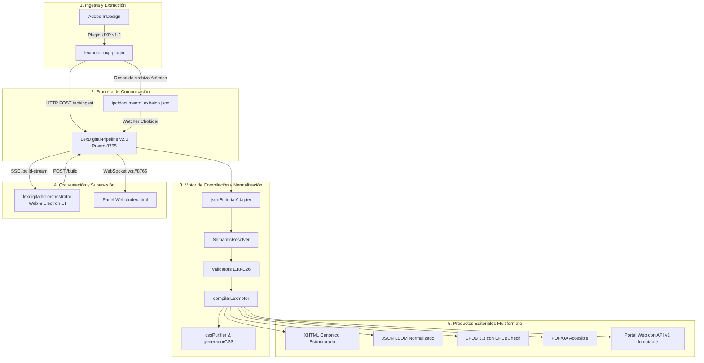

# Manual de Referencia Técnica: Arquitectura, Operación y Mantenimiento del Pipeline Editorial LexDigitalHD

**Documento:** Manual Técnico y Protocolo Operacional de Referencia  
**Ecosistema:** LexDigitalHD v2.0  
**Fecha de Publicación:** 2026-09-27  
**Estado:** Certificado en Producción  
**Destinatarios:** Ingenieros de Software, Auditores de Sistemas y Mantenedores Editoriales

---

## 1. Topología General del Ecosistema

LexDigitalHD es una plataforma de ingeniería editorial que transforma documentos jurídicos de alta complejidad (códigos, decretos, constituciones) desde Adobe InDesign a formatos digitales accesibles (XHTML, EPUB3, PDF/UA, Web pública).



---

## 2. Mapa de Componentes y Responsabilidades

| Componente | Ruta en el Repositorio | Responsabilidad Principal | Tecnologías Clave |
| :--- | :--- | :--- | :--- |
| **UXP Plugin** | [lexmotor-uxp-plugin/](file:///home/donache/hernandario1957.github.io/lexmotor-uxp-plugin) | Extracción de AST, jerarquías de párrafos y metadatos desde InDesign. | Adobe UXP v5/v6, JavaScript ES6 |
| **Pipeline Core Daemon** | [LexDigital-Pipeline/](file:///home/donache/hernandario1957.github.io/LexDigital-Pipeline) | Daemon HTTP/WebSocket, servidor de compilación, watchdog y normalizador. | Node.js v22, Express, ws, Puppeteer |
| **Compilador Editorial** | `src/core/` / `core/` | Motor de parsing de reglas jurídicas, validación por capas y construcción XHTML. | Node.js, Regex con caché mtime |
| **Orquestador** | [lexdigitalhd-orchestrator/](file:///home/donache/hernandario1957.github.io/lexdigitalhd-orchestrator) | Supervisión de compilación en tiempo real, interfaz Electron y portal local. | Electron, Express, EventSource (SSE) |
| **Portal y API v1** | `public/` / `scripts/build-public.js` | Sitio público navegable, API estática criptográficamente sellada (`sha256`). | Node.js, Astro, JSON Schema |

---

## 3. Contratos de Datos y Protocolos de Comunicación

### 3.1. Superficie de Endpoints del Servidor Principal (`127.0.0.1:8765`)

| Método | Endpoint | Contrato / Propósito | Códigos HTTP |
| :--- | :--- | :--- | :--- |
| `GET` | `/health` | Chequeo de liveness del servicio y watchdog. | `200 OK` |
| `GET` | `/modular` | Consulta de módulos activos del compilador. | `200 OK` |
| `GET` | `/api/status` | Telemetría detallada, uptime y rutas de almacenamiento. | `200 OK` |
| `GET` | `/build-stream` | Stream unidireccional de Server-Sent Events (`text/event-stream`). | `200 OK` |
| `POST` | `/build` | Disparador de compilación para el orquestador. | `202 Accepted` / `409 Conflict` |
| `POST` | `/api/ingest` | Receptor principal de extracciones desde InDesign UXP. | `200 OK` / `400 Bad Request` |
| `POST` | `/api/pipeline/procesar-json` | Endpoint web para compilar JSON a XHTML, JSON o PDF. | `200 OK` / `500 Error` |
| `POST` | `/render` | Renderizado directo de esquemas LEDM a XHTML. | `200 OK` / `400 Bad Request` |
| `POST` | `/api/compilar` | Endpoint legado para paneles antiguos de InDesign. | `200 OK` / `500 Error` |

### 3.2. Ciclo de Vida del Stream SSE (`/build-stream`)

El canal SSE debe mantenerse persistente. El frontend no deduce el estado por tiempo; espera transiciones explícitas:

```
[Conexión GET /build-stream] ──► Evento Inicial: "data: Conectado a LexDigital..."
                                      │
[POST /build recibido]        ──► "data: > [tx-...] Iniciando pipeline..."
                                      │
[Logs de stdout / stderr]     ──► "data: [Línea de log...]"
                                      │
[Finalización Exitosa]        ──► "data: > Compilación finalizada con éxito."
                                      │
                                  "event: pipeline.completed\n
                                   data: {"status":"success","code":0}\n\n"
```

### 3.3. Estructura de Entrada Polimórfica (`jsonEditorialAdapter`)

El adaptador normaliza 5 variantes históricas hacia un esquema canónico único:

1. **UXP Moderno:** `{ metadata: { documentName: "..." }, document: { nodes: [ { content: "...", attributes: { styleName: "..." } } ] } }`
2. **Fragmentos InDesign:** `{ documento: { titulo: "..." }, fragmentos: [ { texto: "...", estilo: "..." } ] }`
3. **Decretos y Códigos:** `{ documento: "Nombre.indd", contenido: [ { texto: "...", estilo: "..." } ] }`
4. **Leyes Estructuradas:** `{ documento: { cuerpo_ley: [ { elementos: [ ... ] } ] } }`
5. **Esquema Canónico Directo:** `{ documento: { titulo: "..." }, contenido: [ { texto: "...", tipo: "..." } ] }`

**Sanitización Automática Aplicada:**
- Retornos de carro nativos de InDesign (`\r` o `\r\n` a `\n`).
- Eliminación de BOM (`\uFEFF`) y espacios de ancho cero (`\u200B`).
- Inferencia de tipologías jurídicas (`articulo`, `capitulo`, `titulo_parte`, `paragrafo_normativo`, `inciso`).

---

## 4. Gestión del Servicio en Producción (Systemd Daemon)

El pipeline opera como servicio de usuario desatendido en Linux Mint/Ubuntu:

* **Unidad:** [~/.config/systemd/user/lexdigital-watchdog.service](file:///home/donache/.config/systemd/user/lexdigital-watchdog.service)
* **Comando:** `/usr/bin/env node /home/donache/hernandario1957.github.io/LexDigital-Pipeline/server.js`
* **Directorio de Trabajo:** `/home/donache/hernandario1957.github.io/LexDigital-Pipeline`

### Comandos de Operación Rápida

```bash
# Ver estado del servicio
systemctl --user status lexdigital-watchdog.service

# Reiniciar el servidor tras cambios de código
systemctl --user restart lexdigital-watchdog.service

# Ver telemetría y logs en tiempo real
journalctl --user -u lexdigital-watchdog.service -f

# Recargar configuración si se edita el archivo .service
systemctl --user daemon-reload
```

---

## 5. Playbook de Mantenimiento y Resolución de Fallas (Troubleshooting)

### Escenario A: "Error cargando módulo principal: Cannot find module '../src'"
* **Causa:** Un script de diagnóstico asume que el directorio de trabajo es `scripts/` y no la raíz del proyecto.
* **Solución:** Utilizar resolución dinámica de rutas:
  ```javascript
  const rutaSrc = fs.existsSync('./src') ? path.resolve('./src') : path.resolve(__dirname, '../../src');
  const modulo = require(rutaSrc);
  ```

### Escenario B: "El puerto 8765 ya está en uso (EADDRINUSE)"
* **Causa:** Conflicto entre el daemon `lexdigital-watchdog.service` y una ejecución manual con `node server.js` o `npm run pipeline`.
* **Solución:** Comprobar qué proceso ocupa el puerto:
  ```bash
  lsof -i :8765
  # Si el servicio systemd ya está corriendo, no es necesario lanzar otro servidor en terminal.
  ```

### Escenario C: "TypeError: generarCSSDesdePropiedades is not a function"
* **Causa:** Un script legado invoca el generador dinámico de estilos sin el helper exportado.
* **Solución:** El generador está en [LexDigital-Pipeline/core/generadorCSS.js](file:///home/donache/hernandario1957.github.io/LexDigital-Pipeline/core/generadorCSS.js) y debe exportar `{ generarCSSDesdeStyleModel, generarCSSDesdePropiedades, cargarStyleModel }`.

### Escenario D: En el plugin UXP "Extractor estructural no encontrado en el contexto global"
* **Causa:** [lexmotor-uxp-plugin/index.html](file:///home/donache/hernandario1957.github.io/lexmotor-uxp-plugin/index.html) cargó `index.js` sin antes incluir `StructuredDocumentExtractor.js`.
* **Solución:** Mantener el orden de carga en el HTML:
  ```html
  <script src="src/extraction/InDesignValueNormalizer.js"></script>
  <script src="src/extraction/StructuredDocumentExtractor.js"></script>
  <script src="index.js"></script>
  ```

### Escenario E: Caracteres corruptos o signos interrogación en salida XHTML
* **Causa:** Ingesta de texto codificado en UTF-16LE o con BOM sin normalizar.
* **Solución:** Todas las lecturas de archivos de texto deben pasar por [core/utils/textUtils.js](file:///home/donache/hernandario1957.github.io/LexDigital-Pipeline/core/utils/textUtils.js) (`leerArchivoTextoSeguro`), la cual detecta encoding y remueve BOM.

---

## 6. Procedimiento para Incorporar Nuevas Normas o Publicaciones

1. **Extracción:** Abrir el `.indd` en Adobe InDesign y hacer clic en **"Extraer y Compilar"** en el panel *Lexmotor Compiler*.
2. **Recepción Automática:** El plugin envía la evidencia vía `POST /api/ingest` al daemon `8765`.
3. **Compilación en Milisegundos:** El servidor normaliza los párrafos, aplica las reglas jurídicas, inyecta el CSS purgado y escribe el XHTML en `salidas/xhtml/<nombre>_UXP.xhtml`.
4. **Verificación de Calidad:**
   ```bash
   # Ejecutar suite de pruebas de integridad
   npm test
   # Verificar accesibilidad y EPUB
   npm run ci:epub
   npm run ci:a11y
   ```
5. **Publicación Web:**
   ```bash
   # Regenerar catálogo, timeline y endpoints inmutables
   npm run build:public
   ```
